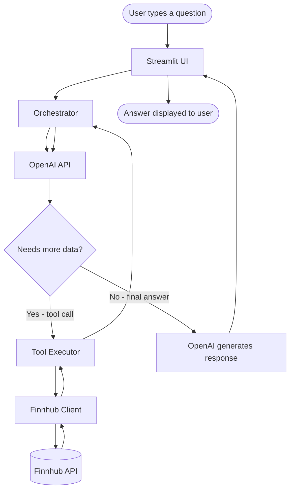

# Stock Insights Assistant

Stock Insights Assistant is a conversational AI application that lets you research stocks using plain English. Instead of navigating complex financial platforms or writing code to query APIs, you simply ask a question in natural language and the assistant handles everything — fetching live market data, interpreting it, and responding in a clear, readable format.

It is built for anyone who wants fast, accurate stock information without needing a finance background or technical expertise. Whether you are a casual investor checking in on a position, a developer exploring LLM tool-use patterns, or a trader wanting a quick overview of a company, this app gives you a conversational interface backed by real-time data.

Under the hood, the app combines the reasoning capabilities of OpenAI's models with live market data from [Finnhub](https://finnhub.io). The LLM acts as an intelligent orchestrator — it reads your question, decides what data to fetch, calls the appropriate tools, and composes a human-friendly answer. You never interact with raw API responses or financial data structures directly.

> "How is AAPL doing today?" → The assistant fetches live data and responds conversationally.

---

## What it does

You type a question like *"Compare TSLA and Ford"* or *"What's NVDA's 52-week high?"* and the app:

1. Sends your question to an OpenAI model
2. The model decides which stock data to fetch (quotes, news, financials, etc.)
3. It calls the [Finnhub](https://finnhub.io) API to get the real-time data
4. Returns a plain-text answer back to you in the chat

---

## Running locally with Docker

This is the easiest way — no Python setup needed. Make sure you have [Docker Desktop](https://www.docker.com/products/docker-desktop) installed on your machine (it includes Docker Compose).

**Step 1 — Get your API keys**

You need two free API keys:
- **OpenAI**: https://platform.openai.com/api-keys
- **Finnhub**: https://finnhub.io (free tier is enough)

**Step 2 — Create your `.env` file**

```bash
cp .env.example .env
```

Then open `.env` and fill in your keys:

```
OPENAI_API_KEY=sk-...
FINNHUB_API_KEY=your_finnhub_key_here
OPENAI_MODEL=gpt-4o-mini
```

**Step 3 — Start the app**

```bash
docker compose up
```

Open http://localhost:8501 in your browser. That's it.

To stop it: `Ctrl+C`, then `docker compose down`.

---

## Running locally without Docker

**Step 1 — Create a virtual environment**

```bash
python3.13 -m venv .venv
source .venv/bin/activate
```

**Step 2 — Install dependencies**

```bash
pip install -r requirements-dev.txt
```

**Step 3 — Create your `.env` file**

```bash
cp .env.example .env
```

Then open `.env` and fill in your keys:

```
OPENAI_API_KEY=sk-...
FINNHUB_API_KEY=your_finnhub_key_here
OPENAI_MODEL=gpt-4o-mini
```

**Step 4 — Run the app**

```bash
streamlit run app/main.py
```

Open http://localhost:8501 in your browser.

---

## Example questions to try

- "How is AAPL doing today?"
- "Compare TSLA and Ford"
- "What are Apple's key financial metrics?"
- "Any recent news about Microsoft?"
- "Find the ticker for Palantir"
- "What's NVDA's 52-week high?"

---

## How it works (architecture)



The orchestrator runs an agentic loop — it keeps asking OpenAI what to do next until the model has enough data to produce a final answer. OpenAI can invoke up to 5 tools per turn, each of which maps to a specific Finnhub endpoint (quote, profile, news, financials, symbol search). Once OpenAI signals it is done, the final text response is rendered in the chat UI.

---

## Running tests

```bash
pip install -r requirements-dev.txt
pytest -v
```

All tests mock external API calls — no real keys required.

---

## Environment variables

| Variable | Description |
|----------|-------------|
| `OPENAI_API_KEY` | Your OpenAI API key |
| `FINNHUB_API_KEY` | Your Finnhub API key |
| `OPENAI_MODEL` | Model to use (default: `gpt-4o-mini`) |